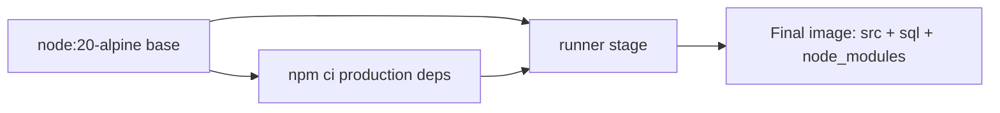
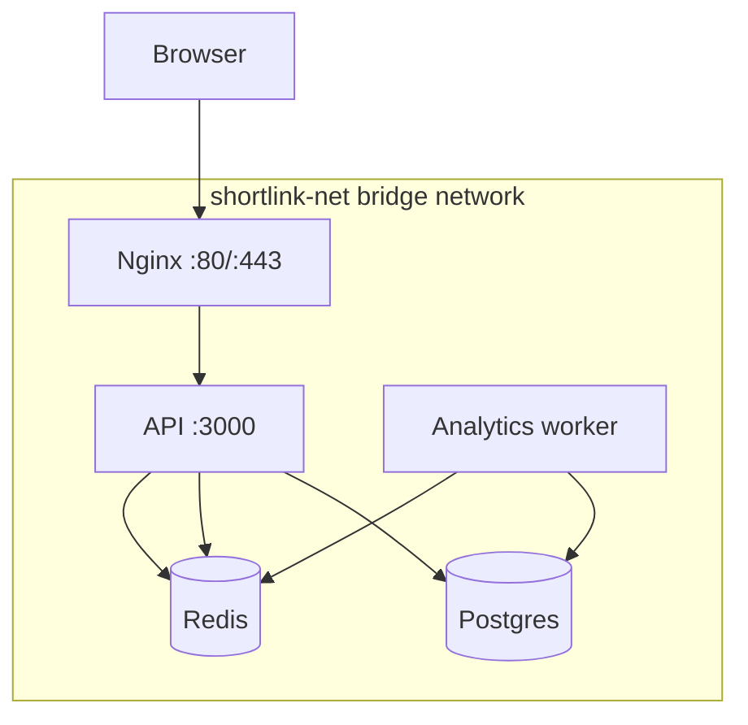
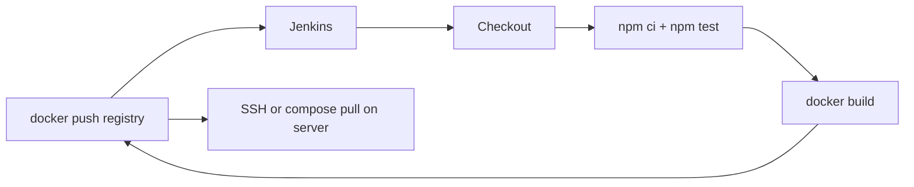
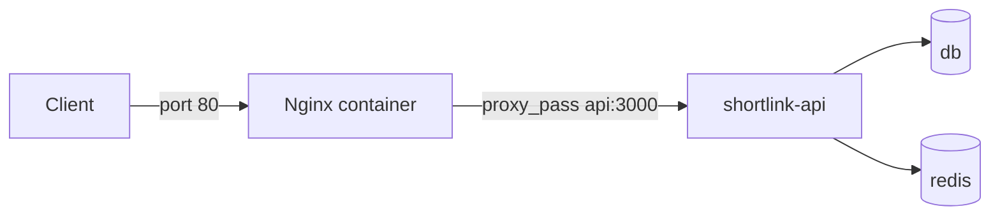
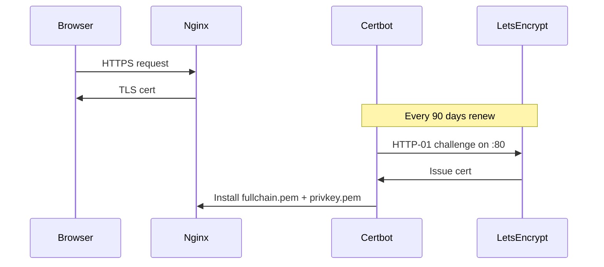

# ShortLink DevOps Learning Guide (Phases 5–9)

This guide walks through each phase using your existing project at [`/home/aviral/Work/Practice/url-shortener-starter`](/home/aviral/Work/Practice/url-shortener-starter). You already have Phase 5 and 6 **partially built**; Phases 7–9 are **not in the repo yet** and are what you will add as you learn.

---

## Where you are today

| Mode | What runs | Config source |
|------|-----------|---------------|
| **Local dev** | `npm start` on host, Postgres/Redis on host | [`.env`](/home/aviral/Work/Practice/url-shortener-starter/.env) with `DATABASE_HOST=localhost` |
| **Docker (planned)** | API + worker + db + redis (+ later nginx) | [`docker-compose.yml`](/home/aviral/Work/Practice/url-shortener-starter/docker-compose.yml) inline `environment` |

Important: these two modes **cannot both bind port 3000** at the same time. The `EADDRINUSE` error you saw means something (often a previous `npm start` or a `shortlink-api` container) was already listening on `3000`. Before starting a new stack, stop the other one.

```bash
# Stop local API (Ctrl+C) OR find/kill the process:
fuser -k 3000/tcp

# Stop compose stack:
docker compose down
```

---

## Phase 5: Docker

### What Docker solves here

Docker packages your Node app + its runtime into an **image**. Anyone (or Jenkins) can run the same image anywhere and get identical behavior.

### Your Dockerfile, line by line

File: [`Dockerfile`](/home/aviral/Work/Practice/url-shortener-starter/Dockerfile)



| Lines | Concept | Why it matters |
|-------|---------|----------------|
| `FROM node:20-alpine AS base` | Base image | Small, secure-ish Linux + Node 20 |
| `AS deps` / `AS runner` | Multi-stage build | Build deps in one stage, copy only `node_modules` into final image — smaller image, no devDependencies |
| `npm ci --omit=dev` | Reproducible install | Uses `package-lock.json`; skips Jest, ESLint, etc. in production image |
| `COPY src`, `COPY sql` | Application layers | Your API code + migration SQL |
| `USER shortlink` | Non-root user | Container compromise is less dangerous |
| `HEALTHCHECK` + `curl /health` | Container self-check | Docker/Kubernetes can restart unhealthy containers |
| `CMD ["node", "src/server.js"]` | Default process | Overridden for worker in Compose |

### `.dockerignore`

File: [`.dockerignore`](/home/aviral/Work/Practice/url-shortener-starter/.dockerignore)

Excludes `node_modules`, `tests`, `.env` from the build context so images build faster and secrets are not baked into layers.

### Commands to practice (in order)

```bash
cd ~/Work/Practice/url-shortener-starter

# 1. Build the image
docker build -t shortlink-api:local .

# 2. Inspect what was built
docker images shortlink-api
docker history shortlink-api:local

# 3. Run API alone (needs Postgres + Redis reachable)
docker run --rm -p 3000:3000 \
  --env-file .env \
  -e DATABASE_HOST=host.docker.internal \
  -e REDIS_HOST=host.docker.internal \
  shortlink-api:local

# 4. Debug inside a container
docker run --rm -it --entrypoint sh shortlink-api:local

# 5. View logs / health
docker logs <container_id>
docker inspect --format='{{.State.Health.Status}}' <container_id>
```

**Key concept:** Inside a container, `localhost` means *the container itself*, not your host. That is why Compose uses service names (`db`, `redis`) as hostnames.

### Exercises

1. Change `EXPOSE` and `PORT` to `3001`, rebuild, run — confirm `curl localhost:3001/health`.
2. Break the build on purpose (delete `sql/`), observe the failure, fix it.
3. Run `docker run` without env vars — your app now throws (no fallbacks in [`src/config/index.js`](/home/aviral/Work/Practice/url-shortener-starter/src/config/index.js)).

---

## Phase 6: Docker Compose

### What Compose solves here

One YAML file defines **multiple containers**, a **private network**, **persistent volumes**, and **startup order**. Your stack:



File: [`docker-compose.yml`](/home/aviral/Work/Practice/url-shortener-starter/docker-compose.yml)

### Concepts mapped to your file

| YAML key | Your usage | Learn this |
|----------|------------|------------|
| `services:` | `db`, `redis`, `api`, `worker` | Each service = one container (usually) |
| `networks: shortlink-net` | Custom bridge | Containers resolve each other by **service name** (`DATABASE_HOST=db`) |
| `volumes: db-data`, `redis-data` | Named volumes | Data survives `docker compose down`; wiped by `docker compose down -v` |
| `depends_on: condition: service_healthy` | api waits for db+redis | Prevents API crash-looping before Postgres is ready |
| `healthcheck` | `pg_isready`, `redis-cli ping`, `curl /health` | Compose knows when a service is truly ready |
| `command:` on worker | Runs analytics worker instead of API | Same image, different process |
| `ports: "3000:3000"` | Publish API to host | `host_port:container_port` |
| `environment:` | Inline env vars | Production secrets; later move to `.env` + `env_file` |

### Commands to practice

```bash
# Start full stack (detached, rebuild)
docker compose up --build -d

# Watch startup order + health
docker compose ps
docker compose logs -f api worker db redis

# Run one-off commands
docker compose exec api sh
docker compose exec db psql -U postgres -d shortlink -c '\dt'

# Scale workers
docker compose up -d --scale worker=3

# Tear down
docker compose down        # keep volumes
docker compose down -v     # delete DB data
```

### Switching from host Postgres/Redis to full Compose

Before `docker compose up`, **stop your host-bound API** and avoid port conflicts:

- Compose Postgres uses port 5432 internally only (not published) — no conflict unless you also run host Postgres on 5432.
- Compose API publishes **3000** — conflicts with `npm start`.

Your [`.env`](/home/aviral/Work/Practice/url-shortener-starter/.env) is for **local dev**. Compose currently uses its **own** credentials (`postgres/postgres`). For learning, that is fine. Later, unify with:

```yaml
api:
  env_file: .env
  environment:
    DATABASE_HOST: db   # override host-only values
    REDIS_HOST: redis
```

### Exercises

1. `docker compose up` and hit `http://localhost:3000/health` — all four checks should be `up`.
2. Register a user, create a URL, visit `/:shortCode`, then `docker compose logs worker` — see analytics jobs complete.
3. `docker compose stop redis` and refresh `/health` — observe `redis: down` and HTTP 503.
4. Kill the `db` volume (`down -v`), bring stack back up — confirm migrations re-run from [`sql/001_init.sql`](/home/aviral/Work/Practice/url-shortener-starter/sql/001_init.sql).

---

## Phase 7: Jenkins CI/CD

### What Jenkins solves here

Automate on every git push:

1. Install deps → run tests
2. Build Docker image
3. Push to a registry (Docker Hub, GHCR, ECR)
4. Deploy (pull + `docker compose up` on a server)

Nothing in the repo implements this yet — you will add a `Jenkinsfile` and run Jenkins (usually in Docker).

### Recommended pipeline for ShortLink



### Files you will create

| File | Purpose |
|------|---------|
| `Jenkinsfile` | Declarative pipeline stages |
| `docker-compose.prod.yml` | Production overrides (image tag, no build) |
| `.env.production` | Secrets on server only (never in git) |

### Example `Jenkinsfile` structure (to implement later)

```groovy
pipeline {
  agent any
  environment {
    IMAGE = 'your-dockerhub-user/shortlink'
    TAG   = "${env.BUILD_NUMBER}"
  }
  stages {
    stage('Test') {
      steps {
        sh 'npm ci'
        sh 'npm test'
      }
    }
    stage('Build') {
      steps {
        sh "docker build -t ${IMAGE}:${TAG} -t ${IMAGE}:latest ."
      }
    }
    stage('Push') {
      when { branch 'main' }
      steps {
        withCredentials([usernamePassword(credentialsId: 'dockerhub', ...)]) {
          sh 'docker login ...'
          sh "docker push ${IMAGE}:${TAG}"
          sh "docker push ${IMAGE}:latest"
        }
      }
    }
    stage('Deploy') {
      when { branch 'main' }
      steps {
        sshagent(['deploy-key']) {
          sh '''
            ssh user@server "cd /app && docker compose pull && docker compose up -d"
          '''
        }
      }
    }
  }
}
```

### Jenkins setup (learning path)

1. **Run Jenkins in Docker** with Docker socket mounted (so Jenkins can run `docker build`):
   ```bash
   docker run -d -p 8080:8080 -v jenkins_home:/var/jenkins_home \
     -v /var/run/docker.sock:/var/run/docker.sock jenkins/jenkins:lts
   ```
2. Install plugins: **Docker Pipeline**, **Credentials**, **SSH Agent**, **Git**.
3. Add credentials: Docker registry username/password, deploy SSH key.
4. Create a **Multibranch Pipeline** or **Pipeline** job pointing at your repo + `Jenkinsfile`.
5. Webhook from GitHub/GitLab → Jenkins on push.

### What Jenkins validates for ShortLink

- `npm test` — 78 tests, coverage gate in [`jest.config.js`](/home/aviral/Work/Practice/url-shortener-starter/jest.config.js)
- `docker build` — Dockerfile must produce a healthy image
- Optional: smoke test after deploy — `curl https://yourdomain/health`

### Security notes (important for real CI/CD)

- Never commit `.env` with real secrets; Jenkins uses **Credentials** store.
- Use separate JWT secrets for production vs development.
- Scan images with `trivy` or Docker Scout in a later stage.

---

## Phase 8: Nginx (reverse proxy)

### What Nginx solves here

Your Express API should not sit directly on the public internet. Nginx sits in front and:

- Terminates HTTP (and later HTTPS)
- Routes `yourdomain.com` → `api:3000`
- Can serve static files, gzip, rate limits at the edge
- Provides a single entry point (`:80` / `:443`) while API stays internal

Your app is already proxy-aware:

```javascript
// src/app.js
app.set('trust proxy', 1);
```

And [`src/utils/userAgent.js`](/home/aviral/Work/Practice/url-shortener-starter/src/utils/userAgent.js) reads `X-Forwarded-For` for client IP — required once Nginx is in front.

### Architecture after Phase 8



### Files you will add

| File | Purpose |
|------|---------|
| `nginx/nginx.conf` | Main config |
| `nginx/conf.d/shortlink.conf` | Upstream + `location /` proxy rules |
| `docker-compose.yml` | New `nginx` service |

### Example Nginx server block (to implement)

```nginx
upstream shortlink_api {
  server api:3000;
}

server {
  listen 80;
  server_name localhost;   # later: shortlink.example.com

  location / {
    proxy_pass http://shortlink_api;
    proxy_http_version 1.1;
    proxy_set_header Host $host;
    proxy_set_header X-Real-IP $remote_addr;
    proxy_set_header X-Forwarded-For $proxy_add_x_forwarded_for;
    proxy_set_header X-Forwarded-Proto $scheme;
  }
}
```

### Compose changes (conceptual)

- **Remove** `ports: "3000:3000"` from `api` (API only on internal network).
- **Add** `nginx` service with `ports: "80:80"`, mounting `./nginx`.
- Set `BASE_URL=http://localhost` (or your domain) so short links in API responses are correct.

### Commands to practice

```bash
docker compose exec nginx nginx -t      # test config
docker compose exec nginx nginx -s reload
curl -I http://localhost/health
curl -I http://localhost/api/auth/login -X POST
```

### Exercises

1. Access API only via Nginx (`http://localhost/health`), confirm direct `:3000` is closed.
2. Create a short URL, follow redirect — confirm analytics still enqueue.
3. Intentionally misconfigure `proxy_set_header` and observe wrong client IP in analytics.

---

## Phase 9: HTTPS

### What HTTPS solves here

Encrypts traffic between browser and Nginx. Certificates are issued to a **domain name**, not `localhost` (unless using mkcert for local dev).

### Two learning paths

| Approach | Best for | Tool |
|----------|----------|------|
| **Local dev** | Learning on laptop | [mkcert](https://github.com/FiloSottile/mkcert) — trusted local CA |
| **Production** | Real deployment | Let's Encrypt + Certbot |

### Production flow (Let's Encrypt)



### Files you will add

| File | Purpose |
|------|---------|
| `nginx/conf.d/shortlink-ssl.conf` | `listen 443 ssl`, cert paths |
| `docker-compose.yml` | `certbot` service (optional), volume `certbot-certs` |
| `.env` / compose | `BASE_URL=https://shortlink.yourdomain.com` |

### Example SSL server block (to implement)

```nginx
server {
  listen 443 ssl http2;
  server_name shortlink.yourdomain.com;

  ssl_certificate     /etc/letsencrypt/live/shortlink.yourdomain.com/fullchain.pem;
  ssl_certificate_key /etc/letsencrypt/live/shortlink.yourdomain.com/privkey.pem;

  location / {
    proxy_pass http://shortlink_api;
    proxy_set_header X-Forwarded-Proto https;
    # ... other proxy headers
  }
}

server {
  listen 80;
  server_name shortlink.yourdomain.com;
  return 301 https://$host$request_uri;
}
```

### Certbot with Docker (typical pattern)

1. First boot: Nginx serves HTTP only; Certbot obtains cert via webroot or standalone.
2. Mount `/etc/letsencrypt` into Nginx container.
3. Cron or Certbot container renews certs; `nginx -s reload` after renewal.

### Jenkins integration (Phase 7 + 9)

Add a deploy stage that:

1. Pulls new image
2. Runs `docker compose up -d`
3. Smoke-tests `curl -f https://yourdomain/health`

### Exercises

1. **Local:** use mkcert, mount certs into Nginx, browse `https://localhost`.
2. **Production:** point a real domain A-record to your server, run Certbot, verify padlock in browser.
3. Update `BASE_URL` to `https://...`, create a URL, confirm `short_url` in JSON uses HTTPS.

---

## Suggested learning order and checklist

| Phase | Goal | Done when |
|-------|------|-----------|
| **5 Docker** | Understand image build + `docker run` | You can build, run, and debug `shortlink-api:local` |
| **6 Compose** | Run full stack with one command | `docker compose up` → register → shorten → redirect → worker logs |
| **7 Jenkins** | Automate test + build + deploy | Push to git triggers green pipeline and deploys |
| **8 Nginx** | Proxy all traffic through port 80 | API not exposed on 3000; `/health` works via Nginx |
| **9 HTTPS** | Encrypt traffic | `https://` works; HTTP redirects; `BASE_URL` updated |

---

## Common pitfalls (from your project)

1. **Port 3000 in use** — stop host `npm start` or old containers before Compose.
2. **Host vs container networking** — `.env` uses `localhost`; Compose must use `db` / `redis`.
3. **Secrets in compose** — `docker-compose.yml` has placeholder JWT secrets; rotate for production.
4. **Worker depends on API** — worker only needs db+redis; API dependency is for startup ordering, not runtime.
5. **Short link domain** — `BASE_URL` must match what users see in the browser (especially after Nginx/HTTPS).

---

## Optional next files to add (when you are ready to implement)

These are **not** in the repo today; adding them is the hands-on work for Phases 7–9:

- `Jenkinsfile`
- `nginx/nginx.conf` + `nginx/conf.d/shortlink.conf`
- `docker-compose.prod.yml` (image from registry, no local build)
- `docker-compose.override.yml` for local nginx + mkcert experiments
