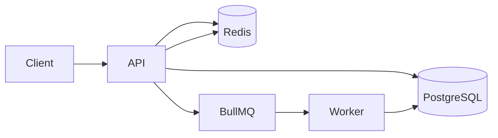

# ShortLink

Production-ready URL shortener backend with authentication, analytics, Redis caching, and BullMQ background jobs. Built for learning Docker, networking, reverse proxies, and DevOps workflows.

## Architecture

Layered architecture with clear separation of concerns:

```
Client
  ↓
Routes          (HTTP routing, validation wiring)
  ↓
Controllers     (request/response only)
  ↓
Services        (business logic)
  ↓
Repositories    (raw SQL via pg)
  ↓
PostgreSQL
```

Supporting infrastructure:

- **Redis** — cache-aside for URL lookups and analytics (1 hour TTL)
- **BullMQ** — async analytics processing on redirect
- **Worker** — consumes analytics jobs and updates PostgreSQL



## Tech Stack

| Layer | Technology |
|-------|------------|
| Runtime | Node.js 20 (ES Modules) |
| Framework | Express |
| Database | PostgreSQL (`pg`) |
| Cache | Redis (`ioredis`) |
| Queue | BullMQ |
| Auth | JWT + bcrypt |
| Validation | Zod |
| Testing | Jest + Supertest |

## Folder Structure

```
shortlink/
├── src/
│   ├── app.js
│   ├── server.js
│   ├── config/
│   ├── controllers/
│   ├── routes/
│   ├── middleware/
│   ├── services/
│   ├── repositories/
│   ├── database/
│   ├── validators/
│   ├── cache/
│   ├── queue/
│   ├── workers/
│   ├── utils/
│   └── constants/
├── tests/
│   ├── unit/
│   └── integration/
├── sql/
├── Dockerfile
├── docker-compose.yml
├── package.json
├── .env.sample
└── README.md
```

## API Documentation

### Health

| Method | Endpoint | Auth | Description |
|--------|----------|------|-------------|
| GET | `/health` | No | Server, DB, Redis, and queue status |

### Authentication

| Method | Endpoint | Auth | Description |
|--------|----------|------|-------------|
| POST | `/api/auth/register` | No | Register a new user |
| POST | `/api/auth/login` | No | Login and receive tokens |
| POST | `/api/auth/refresh` | No | Refresh access token |
| POST | `/api/auth/logout` | Yes | Invalidate refresh token |

**Register / Login body:**
```json
{
  "name": "Jane Doe",
  "email": "jane@example.com",
  "password": "securepass123"
}
```

**Refresh / Logout body:**
```json
{
  "refreshToken": "<refresh-token>"
}
```

### Users

| Method | Endpoint | Auth | Description |
|--------|----------|------|-------------|
| GET | `/api/users/profile` | Yes | Get current user profile |
| PUT | `/api/users/profile` | Yes | Update name or email |
| DELETE | `/api/users/account` | Yes | Delete account |

### URLs

| Method | Endpoint | Auth | Description |
|--------|----------|------|-------------|
| POST | `/api/urls` | Yes | Create a short URL |
| GET | `/api/urls` | Yes | List user's URLs |
| DELETE | `/api/urls/:id` | Yes | Delete a URL |
| GET | `/api/urls/:id/analytics` | Yes | Get URL analytics |
| GET | `/:shortCode` | No | Redirect to original URL |

**Create URL body:**
```json
{
  "original_url": "https://example.com/long-page",
  "short_code": "my-link",
  "expires_at": "2026-12-31T23:59:59.000Z"
}
```

`short_code` and `expires_at` are optional.

### Response Format

**Success:**
```json
{
  "success": true,
  "data": {},
  "message": "Operation successful"
}
```

**Failure:**
```json
{
  "success": false,
  "message": "Error description",
  "errors": []
}
```

## Database Schema

### users
| Column | Type | Notes |
|--------|------|-------|
| id | UUID | PK |
| name | TEXT | |
| email | TEXT | UNIQUE |
| password_hash | TEXT | |
| created_at | TIMESTAMPTZ | |
| updated_at | TIMESTAMPTZ | |

### refresh_tokens
| Column | Type | Notes |
|--------|------|-------|
| id | UUID | PK |
| user_id | UUID | FK → users |
| token_hash | TEXT | |
| expires_at | TIMESTAMPTZ | |
| created_at | TIMESTAMPTZ | |

### urls
| Column | Type | Notes |
|--------|------|-------|
| id | UUID | PK |
| user_id | UUID | FK → users |
| original_url | TEXT | |
| short_code | TEXT | UNIQUE |
| expires_at | TIMESTAMPTZ | nullable |
| created_at | TIMESTAMPTZ | |
| updated_at | TIMESTAMPTZ | |

### analytics
| Column | Type | Notes |
|--------|------|-------|
| id | UUID | PK |
| url_id | UUID | FK → urls, UNIQUE |
| click_count | BIGINT | |
| unique_visitors | BIGINT | |
| last_accessed | TIMESTAMPTZ | |

### click_events
| Column | Type | Notes |
|--------|------|-------|
| id | UUID | PK |
| url_id | UUID | FK → urls |
| visitor_id | TEXT | |
| referrer | TEXT | |
| browser | TEXT | |
| operating_system | TEXT | |
| device_type | TEXT | |
| ip_address | TEXT | |
| country | TEXT | placeholder |
| created_at | TIMESTAMPTZ | |

Migrations live in `sql/001_init.sql`.

## Environment Variables

Copy `.env.sample` to `.env`:

| Variable | Description | Default |
|----------|-------------|---------|
| `PORT` | API port | `3000` |
| `NODE_ENV` | Environment | `development` |
| `BASE_URL` | Public base URL for short links | `http://localhost:3000` |
| `DATABASE_HOST` | PostgreSQL host | `localhost` |
| `DATABASE_PORT` | PostgreSQL port | `5432` |
| `DATABASE_USER` | PostgreSQL user | `postgres` |
| `DATABASE_PASSWORD` | PostgreSQL password | `postgres` |
| `DATABASE_NAME` | Database name | `shortlink` |
| `REDIS_HOST` | Redis host | `localhost` |
| `REDIS_PORT` | Redis port | `6379` |
| `JWT_ACCESS_SECRET` | Access token secret | — |
| `JWT_REFRESH_SECRET` | Refresh token secret | — |
| `JWT_ACCESS_EXP` | Access token TTL | `15m` |
| `JWT_REFRESH_EXP` | Refresh token TTL | `7d` |
| `QUEUE_NAME` | BullMQ queue name | `analytics` |
| `CACHE_TTL` | Cache TTL in seconds | `3600` |

## Project Setup

### Local Development

```bash
# Install dependencies
npm install

# Copy environment file
cp .env.sample .env

# Start PostgreSQL and Redis (or use Docker Compose)
docker compose up -d db redis

# Run API
npm run dev

# Run worker (separate terminal)
npm run worker
```

### Docker

```bash
# Build image
docker build -t shortlink-api .

# Run container
docker run -p 3000:3000 --env-file .env shortlink-api
```

### Docker Compose

```bash
# 1. Create Docker-specific env file (uses service names db/redis, not localhost)
cp .env.docker.sample .env.docker

# 2. Start all services (API, worker, PostgreSQL, Redis)
docker compose up --build

# Run in background
docker compose up -d --build

# View logs
docker compose logs -f api worker

# Stop services
docker compose down

# Stop and remove volumes
docker compose down -v
```

Services:

| Service | Port | Description |
|---------|------|-------------|
| api | 3000 | Express API |
| worker | — | BullMQ analytics worker |
| db | 5432 (internal) | PostgreSQL |
| redis | 6379 (internal) | Redis |

## Development Guide

```bash
# Run tests with coverage
npm test

# Lint
npm run lint

# Format
npm run format
```

### Testing

- **Unit tests** — validators, utilities, response helpers
- **Integration tests** — HTTP endpoints with mocked repositories

Coverage threshold is set to 80% in `jest.config.js`.

## Production Considerations

- Change `JWT_ACCESS_SECRET` and `JWT_REFRESH_SECRET` to strong random values
- Set `BASE_URL` to your public domain (e.g. `https://short.example.com`)
- Run behind a reverse proxy (nginx, Traefik) with TLS termination
- Use managed PostgreSQL and Redis in production
- Scale workers independently: `docker compose up --scale worker=3`
- Monitor `/health` for orchestrator health checks
- Set `NODE_ENV=production`
- Configure CORS origins explicitly for your frontend domain
- Rate limiting is enabled (100 requests/minute per IP)

## License

MIT
